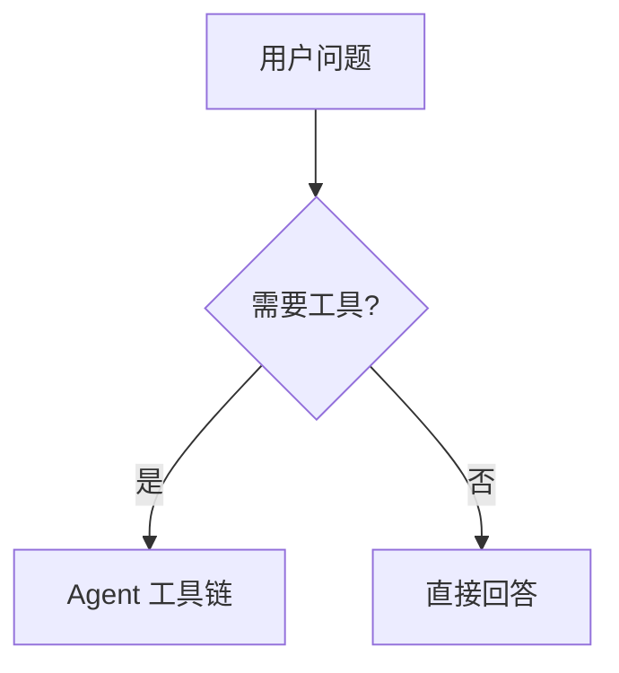

# Chat Visuals · 对话内图表（高质量）

对话框已支持两种**可渲染**围栏（不要只给 ASCII / 纯文字表敷衍）：

## 1. Mermaid · 流程 / 架构 / 时序 / 状态

````markdown

````

常用图型：`flowchart` / `sequenceDiagram` / `stateDiagram-v2` / `erDiagram` / `mindmap` / `gantt`  
约束：节点 ID 用英文短词；中文写在 `[]` / `()` 标签里；单图尽量 ≤25 个节点；少用 `&` 裸字符。

## 2. Chart.js JSON · 数值图（栏 / 线 / 饼 / 雷达）

围栏语言：`chart` 或 `chartjs`，内容为 **合法 JSON**：

````markdown
```chart
{
  "type": "bar",
  "data": {
    "labels": ["周一", "周二", "周三"],
    "datasets": [{
      "label": "完成数",
      "data": [3, 7, 5],
      "backgroundColor": ["#3794ff", "#4ec9b0", "#c586c0"]
    }]
  }
}
```
````

`type`：`bar` | `line` | `pie` | `doughnut` | `radar` | `polarArea`  
颜色：深色 UI 友好的饱和色；系列 ≤4；`options` 可选。

## 何时必须出图

- 用户明确要图 / 流程 / 架构 / 对比看板  
- 步骤 ≥4 或关系是网状（比列表更清晰）  
- 有数字对比（用 `chart`，别用弯弯曲曲 ASCII）

## 质量标准

1. **先一句结论**，再出图（图解释结论，不是替代结论）  
2. 图可读：标签短、方向一致、无孤立节点  
3. 需要两层信息时：一张总览 mermaid + 必要时一张 chart  
4. **禁止**：假数据假装实测；用户没给数就标明「示意」  
5. 不要把图塞进不可渲染的纯文本伪代码块（语言必须是 `mermaid` / `chart`）

## 与模式 / 权限

- **Chat / Agent / Ask / Plan**：气泡都能渲染 `mermaid` / `chart`（同一套 UI）
- **Agent**：还可把 HTML/源码写到 Desktop 或 `~/Documents/juno-artifacts`
- 名称里的 chat = 「对话框」，不是「只能切 Chat 模式」
